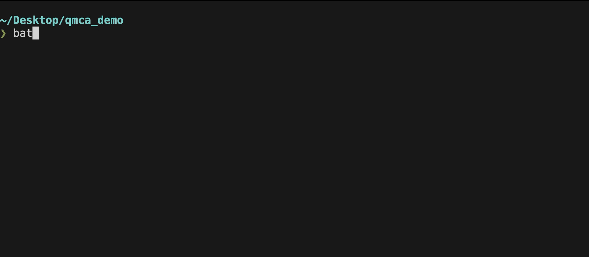
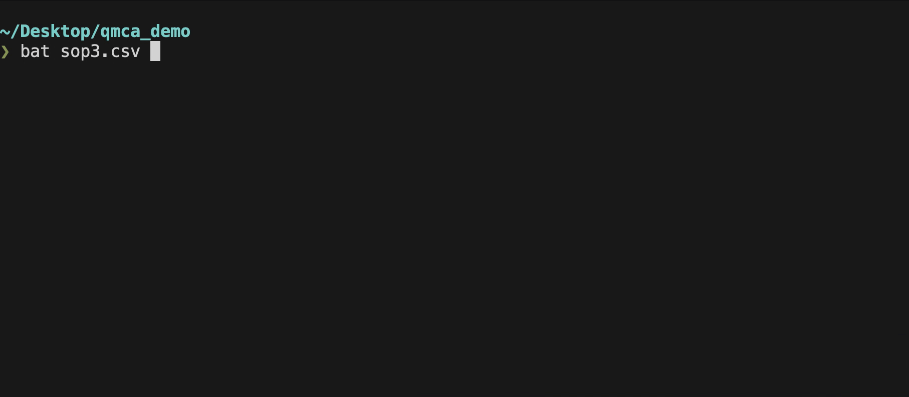

# qmca
QMCA is a Rust implementation of the Quine McCluskey Algorithm. Throughout the implementation small modifications have been made to reduce iterations/comparisons and increase efficiency. 

The project is still in the beta stage. It works, but it ain't pretty. It needs a lot of work for practical purposes. Contributions are always welcome. Please see todo list below.

## Demo




## Features
- Fast
- CSV input
- Cross platform (eventually)
- Memory Safe

## Things ToDo for 0.1.1 Release
- [ ] Split code between multiple files
- [ ] Refactor functions into methods
- [ ] Add file input and output features (CSV? YAML?)
- [ ] Add help section
- [ ] Carefully go through code and increase efficiency
- [ ] Add progress bar(s)
- [ ] Prepare Hombrew/apt/Windows toolchain
- [ ] Add support for POS and Don't-Cares
- [ ] Add testing and error handling...input file handling is bad...
- [ ] Add a safty check to make sure there are no dublicates in the SOP list
- [ ] Add support for Verilog primitive truth table output.

## Installation
```
git clone https://github.com/mtseng15/qmca.git
cd qmca
cargo build --release
```
Then place the binary in `./target/release/qmca` to your prefered path. Or make an alias.
